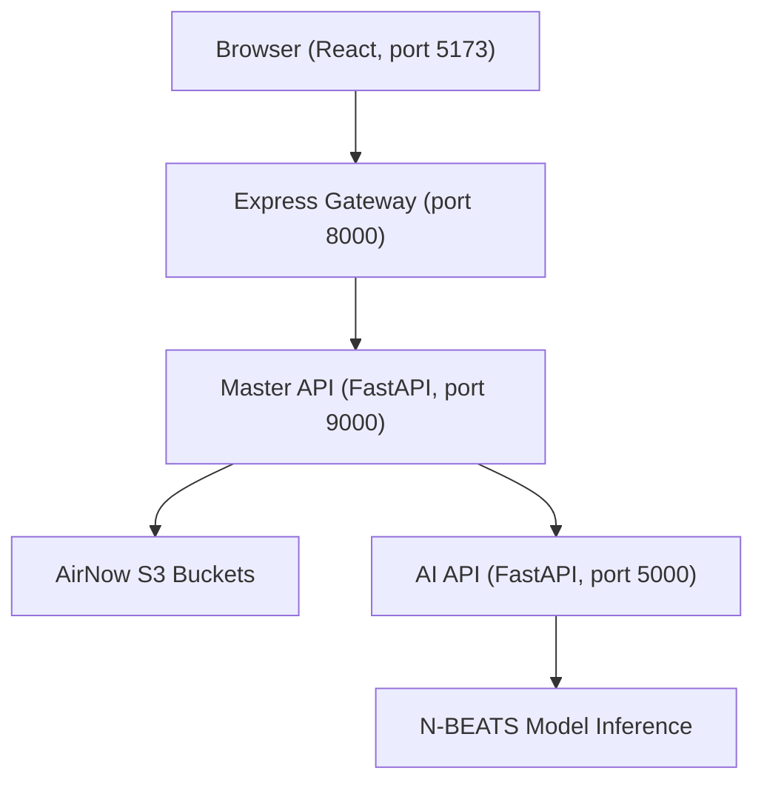

# AQI Prediction System

**AI Model Training Repository:** https://github.com/zeyad-shaban/NasaVibeCodingAIModel

Predicts 12-hour Air Quality Index (AQI) values for any location using N-BEATS time-series models trained on EPA AirNow data.

## Why This Exists

Built for the [NASA Space Apps Challenge 2024](https://www.spaceappschallenge.org/).

Most AQI tools show current conditions. This project forecasts where air quality is heading by using the previous 168 hours of real pollutant data to generate short-term predictions.

## Tech Stack

- React (Vite) — map-based frontend
- Node.js + Express 5 — API gateway
- FastAPI (×2) — orchestration layer and AI inference service
- Python: Darts, scikit-learn, pandas — model pipeline
- N-BEATS — neural time-series forecasting model
- Docker Compose — service orchestration

## Architecture



## Features

- Pick any location on an interactive map and request a forecast.
- Automatically fetches the previous 168 hours of pollutant readings:
  - O₃
  - PM2.5
  - PM10
  - CO
  - SO₂
  - NO₂
- Uses two pre-trained N-BEATS models:
  - Gas pollutants: CO, NO₂, O₃, SO₂
  - Particulates: PM2.5, PM10
- Encodes cyclic temporal features (hour, day of week, month) as sine/cosine pairs to capture daily and seasonal patterns.
- Clips raw concentration predictions to physical bounds before AQI conversion, preventing negative pollution values.

## Installation

### Prerequisites

- Docker
- Docker Compose

### Setup

```bash
git clone https://github.com/Shawky-dev/Hackathon.git
cd Hackathon
docker-compose up --build
```

The frontend will be available at:

```text
http://localhost:5173
```

## Usage

1. Open `http://localhost:5173` in your browser.
2. Click a location on the map.
3. Submit a forecast request.

The system:

1. Finds the nearest AirNow monitoring site.
2. Fetches the previous 168 hours of pollutant data.
3. Runs the data through the N-BEATS forecasting pipeline.
4. Returns predicted pollutant concentrations and AQI values for the next 12 hours.

### Example API Request

```bash
curl -X POST http://localhost:5000/predict \
  -H "Content-Type: application/json" \
  -d '{"site_id":"060371103","forecast_horizon":12,"data":[...]}'
```

## Known Limitations

- Forecasts depend on existing AirNow monitoring sites. Locations without a nearby monitoring station cannot be forecasted.
- The maximum forecast horizon is 12 hours. The models were not trained for longer prediction windows.
- This project was built during a hackathon. Models are pre-trained and static; no retraining pipeline is included in this repository.
- For model training code, see:
  https://github.com/zeyad-shaban/NasaVibeCodingAIModel
- Coverage is strongest in regions served by the EPA AirNow network (primarily the United States). Support outside those regions is limited.
